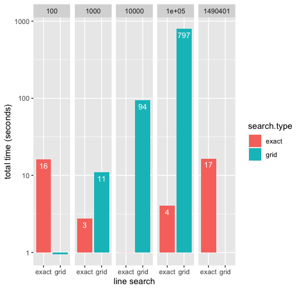
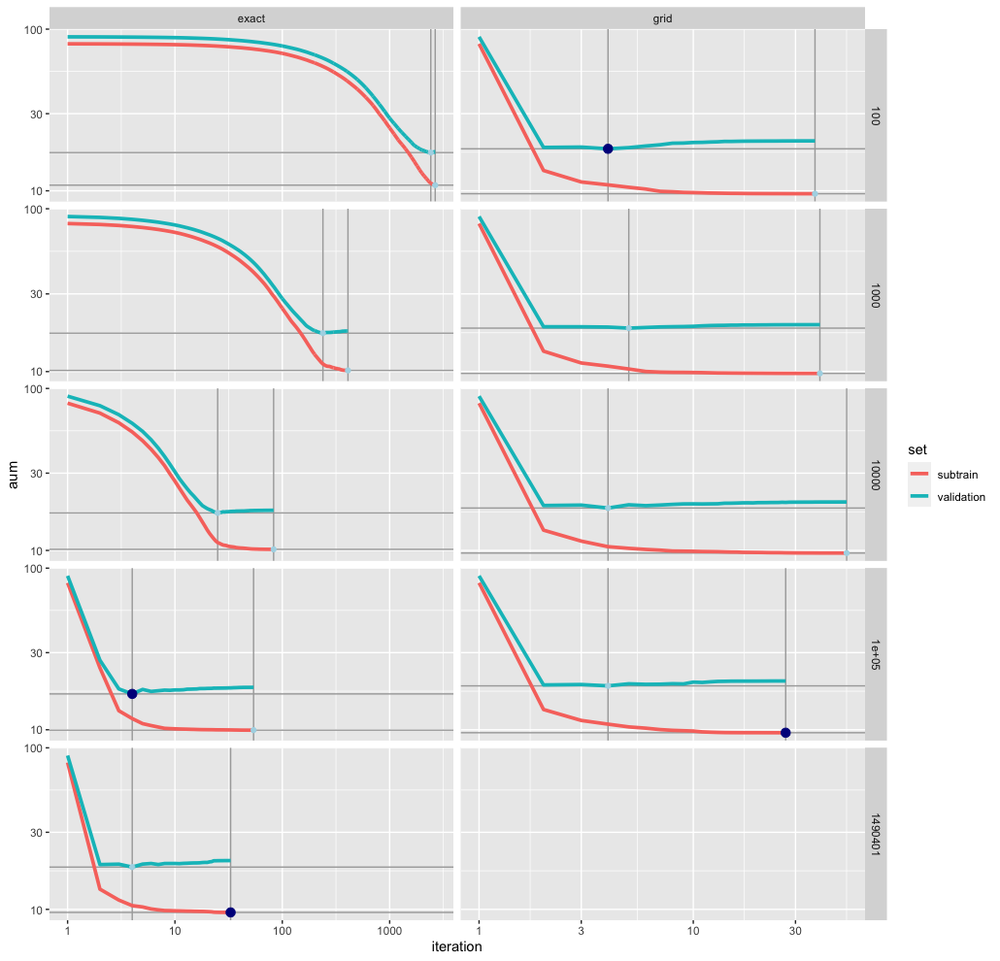
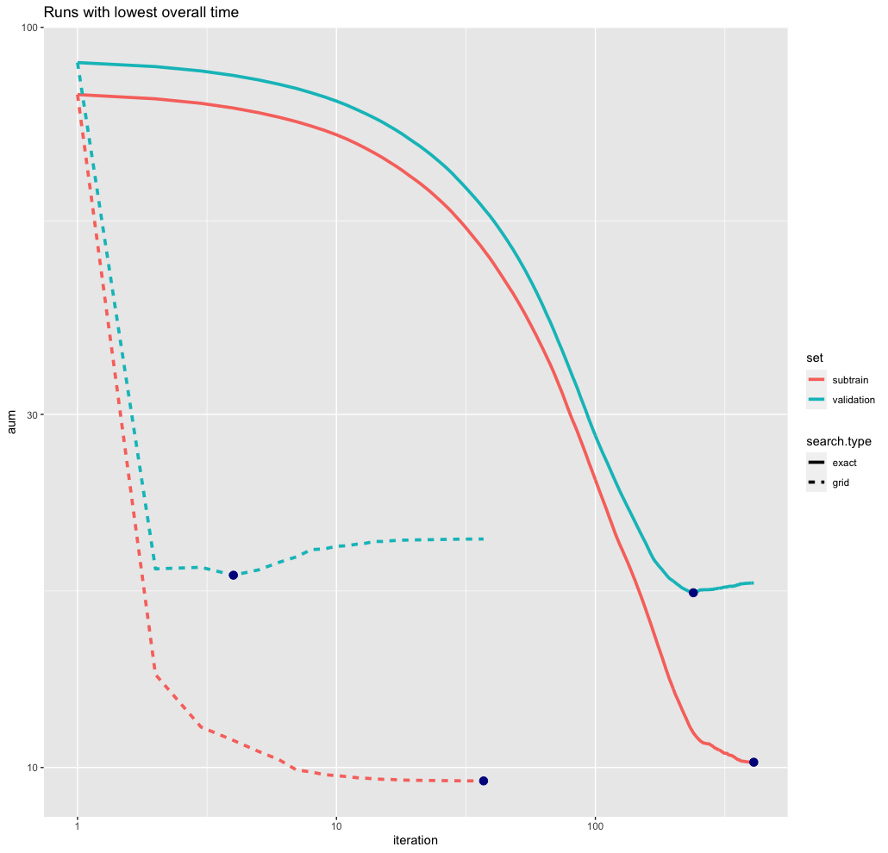
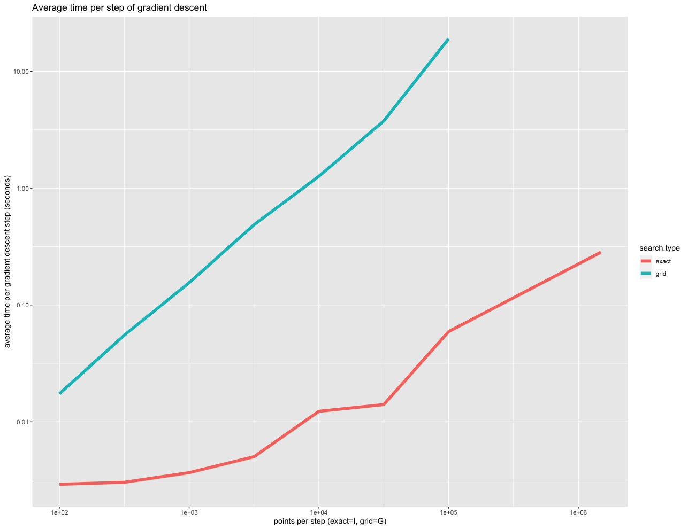
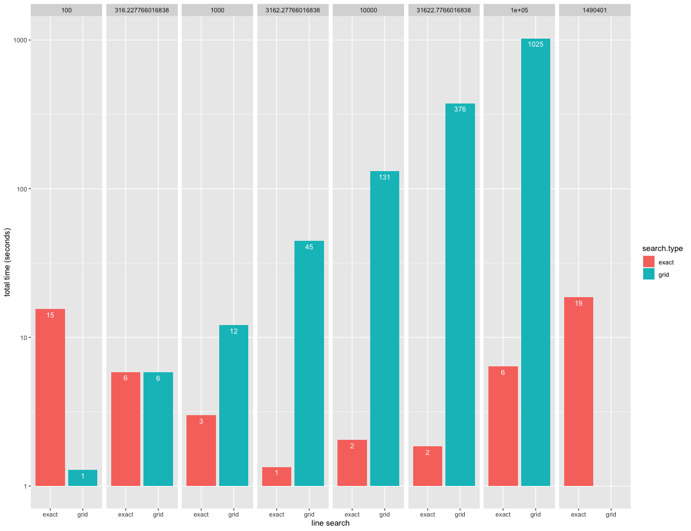
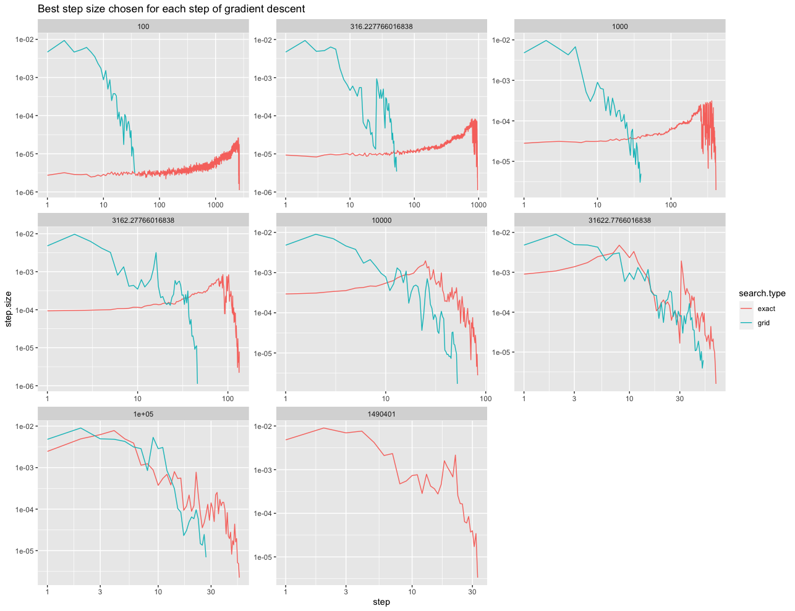
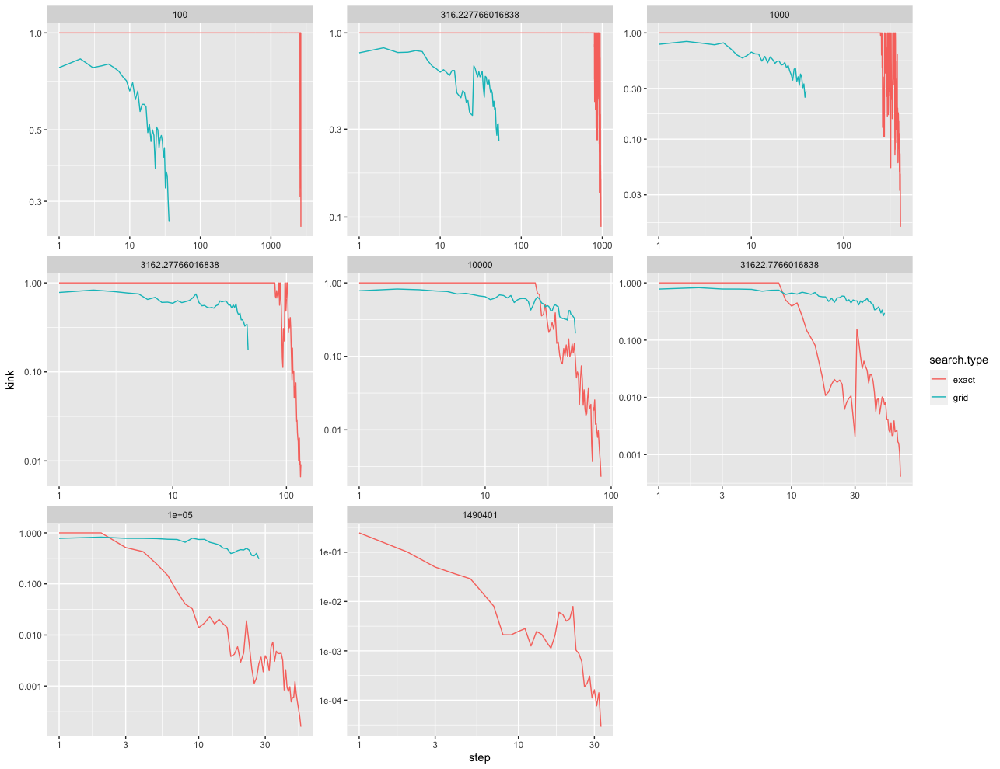
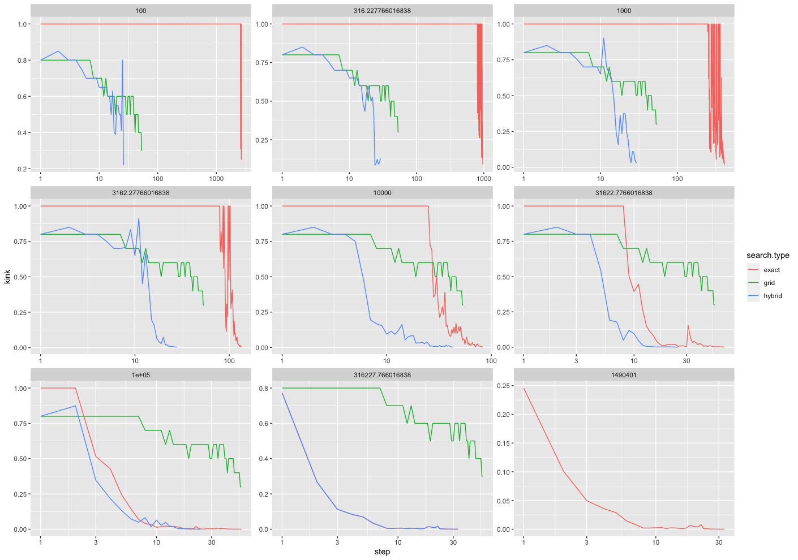

# Week of 2/5/23

## Research Notes

Tasks for this week:

1. properly compare grid vs. exact
2. Create graph for `I` or `G` vs. average time per step
3. track best step size per iteration

### 1. properly compare grid vs. exact

I was comparing `n*I` iterations vs. `G` grid points where I should have just done `I` iterations.
r
> Big Letters
>
> `G` is the amount of grid points we're checking every step of gradient descent.
>
> `I` is the amount iterations performed in our exact line search algorithm in every step of gradient descent.
>
> Grid search is `O(G*n*log(n))`\
> Exact search is `O((I+n)*log(n))`



```r
loss.dt %>%
  group_by(search.type, factor) %>%
  summarize(total.time = sum(time))
# `summarise()` has grouped output by 'search.type'. You can override using the `.groups` argument.
# A tibble: 9 × 3
# Groups:   search.type [2]
  search.type  factor total.time
  <chr>         <dbl>      <dbl>
1 exact           100     16.2  
2 exact          1000      2.74 
3 exact         10000      0.996
4 exact        100000      4.04 
5 exact       1490401     16.5  
6 grid            100      0.952
7 grid           1000     11.0  
8 grid          10000     93.7  
9 grid         100000    797.  
```

Things this graph tells us:

1. 10,000 iterations is optimal for this dataset. The fall and rise of the time matches Toby's testing.
2. Time for grid search is rapidly increasing. I tried 10^6 points and it took way took long.
3. Grid search is really fast at 100 points.

Here's the full matrix of runs:



```r
   search.type        set  factor       aum
1:       exact   subtrain 1490401  9.576477
2:       exact validation  100000 16.661919
3:        grid   subtrain  100000  9.584378
4:        grid validation     100 18.189046
```

> `exactq` == exact where `I = (n*(n-1))/2`, the maximum value
> for `I`.

Observations about this graph:

1. Best subtrain AUM is from the `exactq` run.
2. Best validation AUM is from the exact run that took 4 seconds.

Graph comparing the fastest run for both exact & grid search:



### 2. Create graph for `I` or `G` vs. average time per step





### 3. track best step size per iteration

```r
      step  points search.type       aum    step.size         kink
   1:    1     100       exact 81.029080 2.730294e-06 1.000000e+00
   2:    2     100       exact 80.907154 3.189342e-06 1.000000e+00
   3:    3     100       exact 80.797588 2.866046e-06 1.000000e+00
   4:    4     100       exact 80.689209 2.834990e-06 1.000000e+00
   5:    5     100       exact 80.578376 2.899189e-06 1.000000e+00
  ---                                                             
4699:   29 1490401       exact  9.578686 3.709742e-05 1.111463e-04
4700:   30 1490401       exact  9.577375 3.970103e-05 1.626794e-04
4701:   31 1490401       exact  9.577125 1.721003e-05 7.656786e-05
4702:   32 1490401       exact  9.576477 3.436274e-05 1.417759e-04
4703:   33 1490401       exact  9.576383 3.354607e-06 2.905532e-05
```





## Meeting Notes

Most people don't do grid search for 10,000 points.

Hybrid Line Search: start with exact. If we're choosing points where kink=1, run grid search to find a bigger step size.

Other data sets!!

---

Here's a working Hybrid algorithm:


Grid search here is a static 10 points for comparison.

1. Run exact
2. if kink == 1, run grid w 20 points
3. choose best
