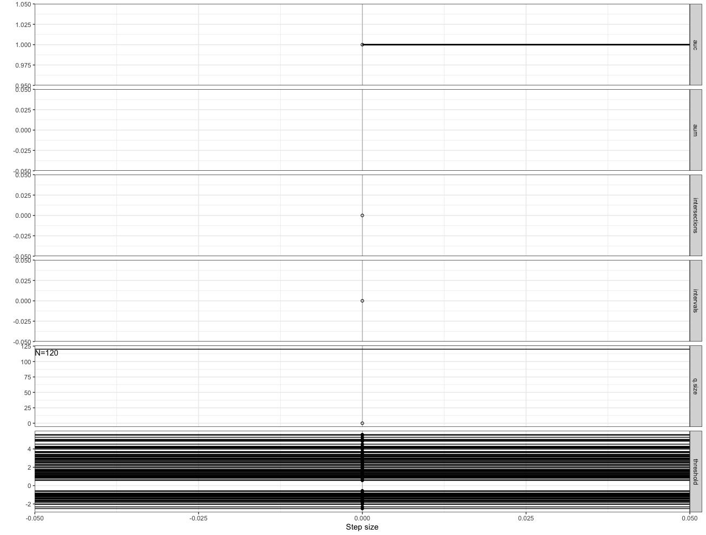
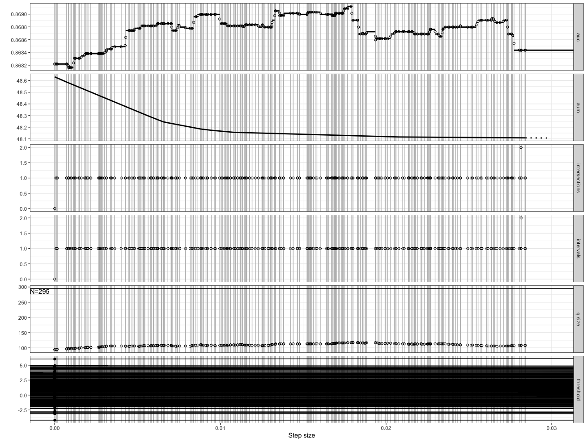
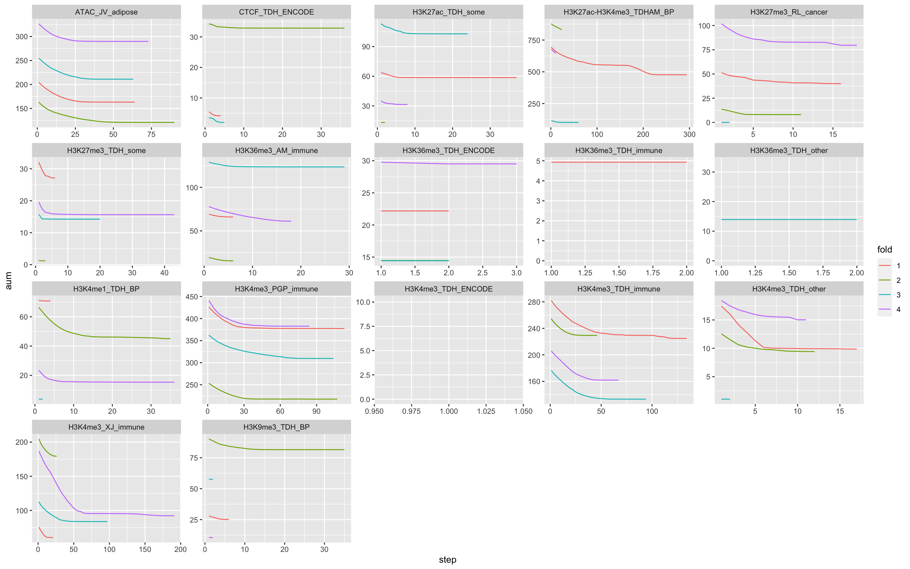

# Week of 3/5/23

Dataset with no improvement:

The threshold functions don't intersect.

The maximum amount of intersections I've seen is 2.

I'm not sure how to replace minimizing the prediction vector with optimizing weights for a linear model.

Optimizing inidividual prediction vectors for each dataset/fold:

Not super useful but it's a start!
