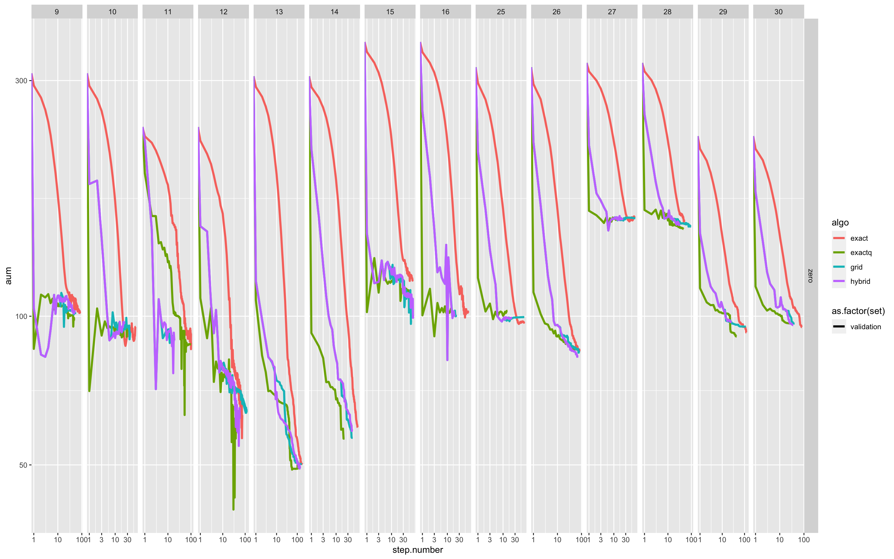
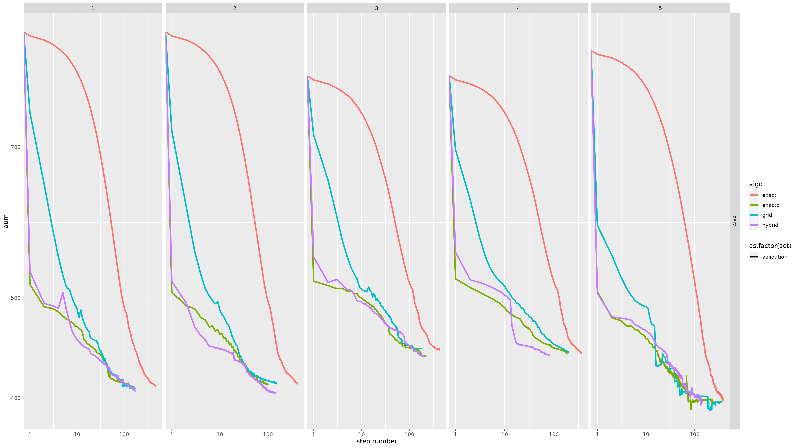
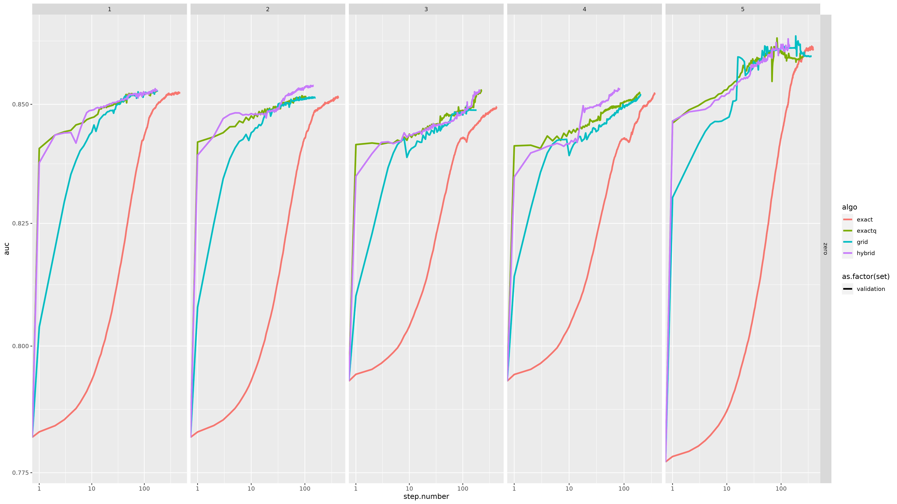
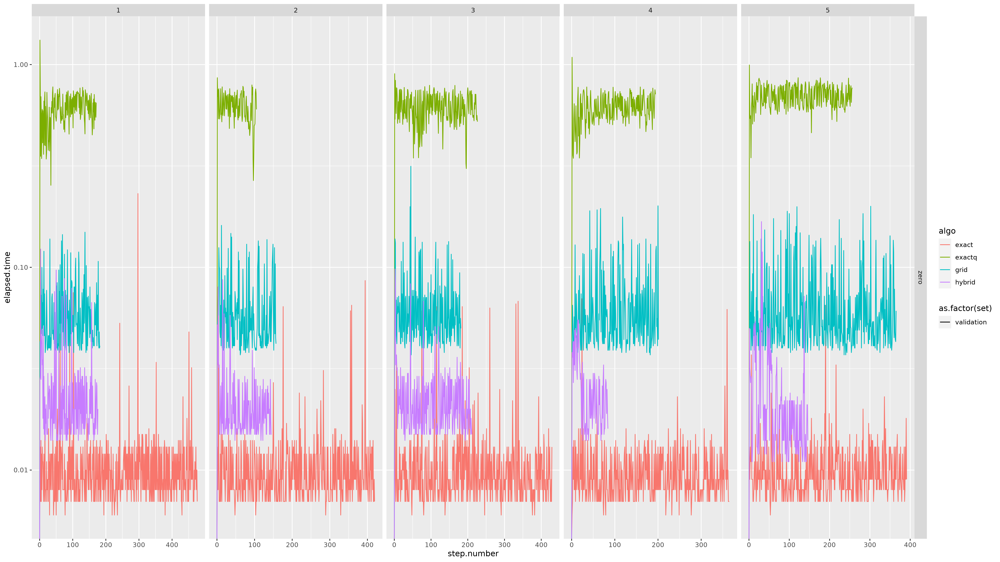
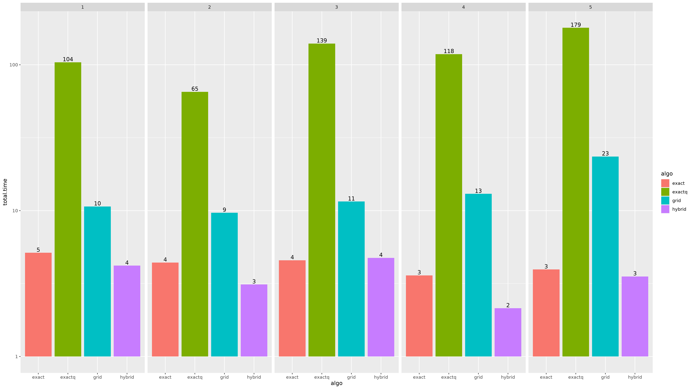

# Monsoon experiments

Testing running all of these algorithms Ignore `hybrid` here, it's not the same algorithm as the ones below.

Minimizing AUM. `hybrid` performs as well as `exactq` here.

Time elapsed per iteration of gradient descent. `hybrid` starts out as slow as `grid`, but then drops down to a little above `exact`.

`hybrid` is as fast as `exact` while getting AUM/AUC values similar to `exactq`.
