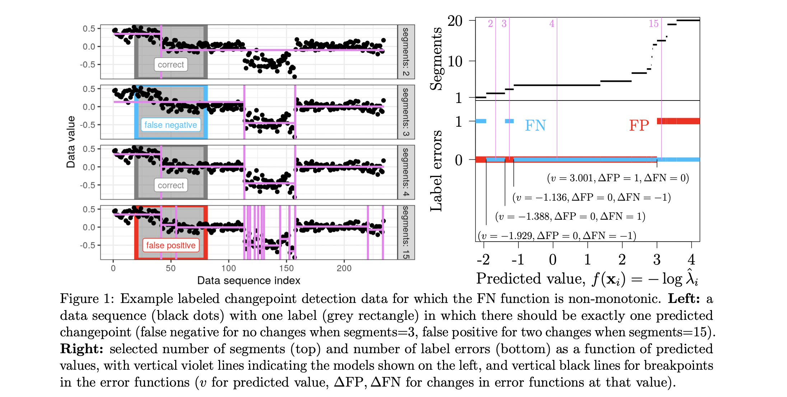
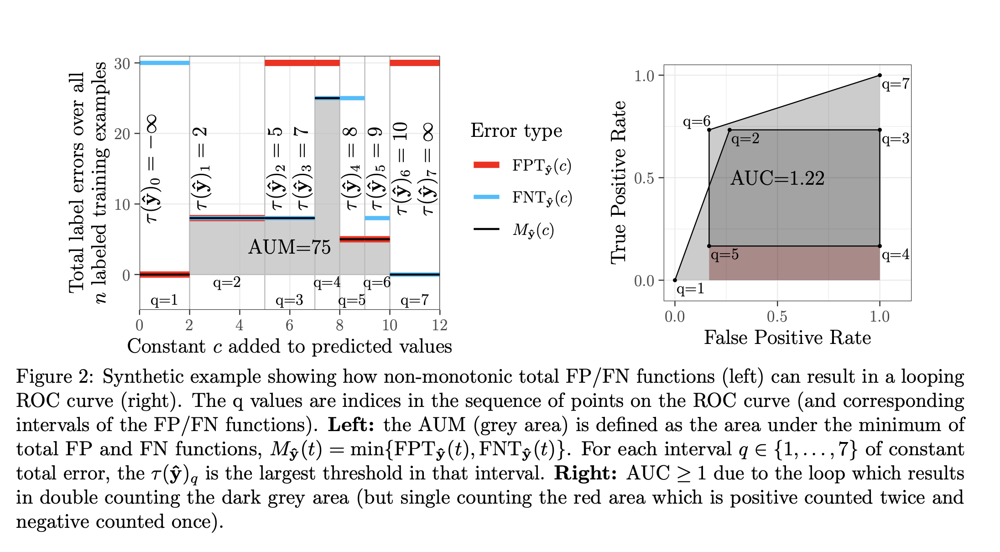

# Graduate Research Log

First week!

## 22 09 05
Goals:
- [ ] Make timeline
- [ ] Understand AUM implementation
- [ ] Understand AUM Line Search
  - section 2.4-2.5 for math, algo is theorem 1, pseudocode in section 3.

Rust implementation:
- What exactly is an Intersection?
- "Threadhold evolution"?? 
- Rust implementation
  - [Rust <-> Python](https://itnext.io/how-to-bind-python-numpy-with-rust-ndarray-2efa5717ed21) ndarray
  - c++ multiset <-> BTreeMap w/ weak ordering
  - [Polars](https://github.com/pola-rs/polars) might be useful for interop?

### Timeline?

- Build algorithm in Rust
- Connect Rust to Python via numpy
- Test with real data from the AUM paper?

## 22 09 03

Digging into the new algorithm...
`f(x) = w^T * x`

For every breakpoint `b` there is a (breakpoint-specific) "threshold evolution" function
`T(s) = s*d + z` where
- `s` is step size
- `d` is the slope after the breakpoint
- `z` is the intercept

AUM(s) = the sume of differences between threshold evolution function outputs

## 22 09 01

### Area Under Min(FP,FN) loss function (AUM)

Introduced in [this paper](https://arxiv.org/pdf/2107.01285.pdf).

#### What is ROC and why is it used?

"Using accuracy as the evaluation metric can be problematic for data sets with imbalanced labels or for which the desired weighting of the labels is unknown (Cortes and Mohri, 2004; Menon et al., 2013)." A popular approach for comparing models is by analyzing the [Receiver Operator Characteristic](https://en.wikipedia.org/wiki/Receiver_operating_characteristic) (ROC).

ROC plots True Positive Rate against False Positive Rate at a range of thresholds. In binary classification, a vector of predicted values (y hat) can be mapped to a single point (FPR, TPR) in ROC space. 
"Area Under the Curve (AUC) is an evaluation metric which accounts for all possible constants or possibilities for thresholding the prediction vector."

Sometimes, the plot of points isn't a straight line or curve - it's a circle! In change-point problems, changing the threshold will *move points of change* which, when analyzing a particular area, can *remove points of change in that area*. This leads to a circular pattern in the ROC curve, which isn't differentiable. 

AUM is a differentiable surrogate for AUC. [Interactive figures](https://bl.ocks.org/tdhock/raw/545d76ea8c0678785896e7dbe5ff5510/)

In changepoint detection, the FP and FN functions can be non-monotonic. 
"When the false negative function is non-monotonic, the true positive rate is also non-monotonic (the ROC curve can move down as well as up when prediction constant is increased). Given a pre-computed path of changepoint models with loss/size values, the exact breakpoints `(v,∆FP,∆FN)` in such error functions can be efficiently computed using a linear time algorithm" (Vargovich and Hocking, 2021).

## 22 08 30

Extending [AUM](https://arxiv.org/pdf/2107.01285.pdf)

[Use Rust code in R packages](https://cran.r-project.org/web/packages/rextendr/vignettes/package.html)

MultiSet & MultiMap in Rust:
- https://docs.rs/multimap/latest/multimap/
- https://docs.rs/multiset/latest/multiset/struct.HashMultiSet.html

[AUM implementation](https://github.com/tdhock/aum)
